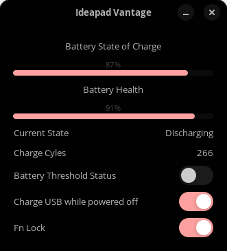

#    Ideapad Vantage
## Version 1.1

System information and settings app for Ideapads on Linux

Tested on IdeaPad 3 15ALC6

## Screenshot

## Installation

### Dependencies

- gtk3-devel
- atk-devel
- cairo-gobject-devel
- vala
- meson
- ninja

 ### Build

` cd Ideapad-Battery Saver `

` meson build `

` cd build `

` ninja install `
